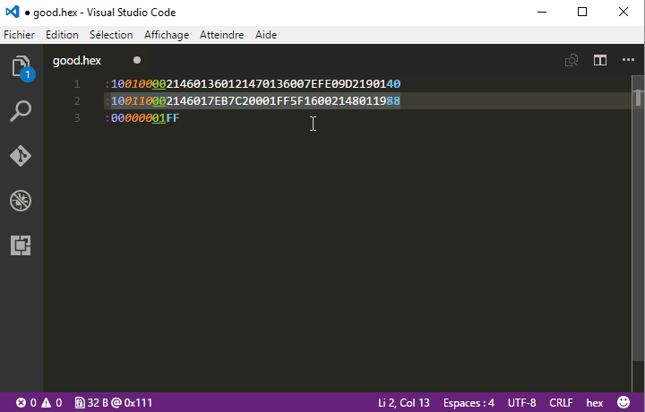
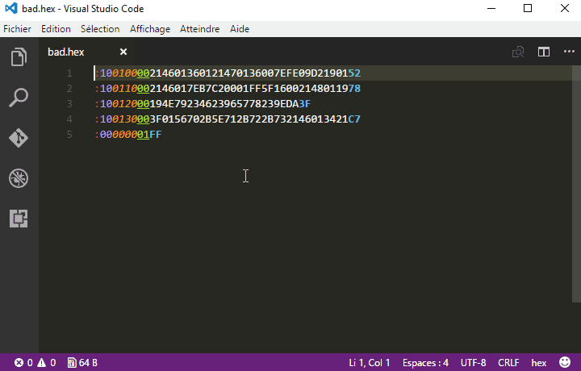

# Intel Hex  for Visual Studio Code

hex-fmt is a Visual Studio Code extension that adds basic support for the [intel hex file format](http://en.wikipedia.org/wiki/Intel_HEX).

## Features

### Color syntax

Color syntax allowes to visualize quickly:
* Start code ":"
* Byte count
* Address
* Record Type
* Data
* Checksum

### Status bar indicators

Adds some information on the status bar:
* Binary size in bytes ie the total number of bytes in the binary information contained in the file without all the intel hex format overhead.
* Address of the cursor location in the binary information. This will only appear if the record type is data (`0x00`) and if the cursor is on the data field.

### File Reparation

Broken hex files can be repaired either automatically on save or by explecitly calling a command.

The reperation process is done record by record and is based on each record header (from startcode to record type).
This means that at least the header must be correct to repair a record. Then the data will be fitted to the byte count and the checksum will be updated.

## Commands

hex-fmt comes with some commands :
* `Hex Repair`: Repair the opened hex file.
* `Hex Find`: Find the position of a given address in the file.

## Extension Settings

This extension contributes the following settings:

* `hex-fmt.repairOnSave`: tells if an hex file must be repaired when saved (default to true).

## License

This project is licensed under the terms of the MIT license.
See [LICENSE.md](LICENSE.md).

## Release Notes

See [CHANGELOG.md](CHANGELOG.md).